# Surface Duo Flutter samples

This repo contains Flutter samples with enhancements for the Microsoft Surface Duo.

The [design_patterns](https://github.com/microsoft/surface-duo-sdk-samples-flutter/tree/master/design_patterns/) project shows how to build the [dual-screen design patterns](https://docs.microsoft.com/en-us/dual-screen/introduction#dual-screen-app-patterns). It is one single application that allows navigating through the following screens:

| Pattern | Folder | Dual-screen screenshot| Single screen screenshot|
| :---------: | :---------: | ----------- | ----------- |
| 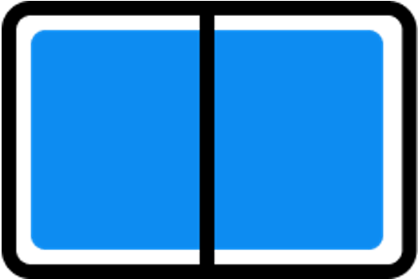 Extended Canvas | [extended_canvas](https://github.com/microsoft/surface-duo-sdk-samples-flutter/tree/master/design_patterns/lib/extended_canvas) | 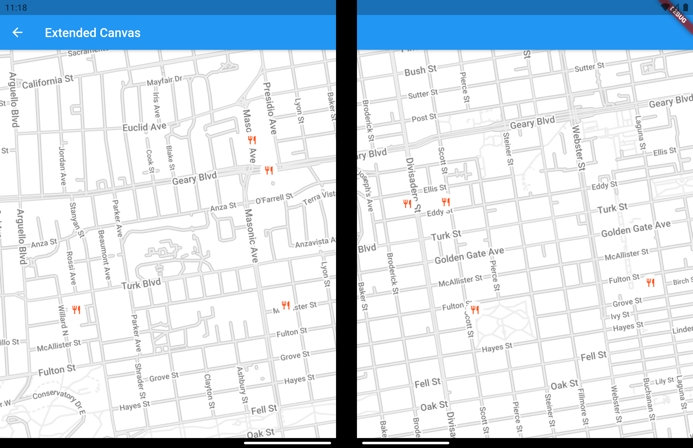 |  |
| 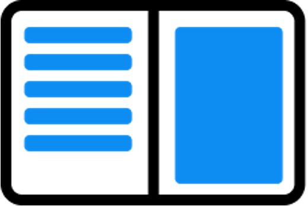 List Detail | [list_detail](https://github.com/microsoft/surface-duo-sdk-samples-flutter/tree/master/design_patterns/lib/list_detail) |  | 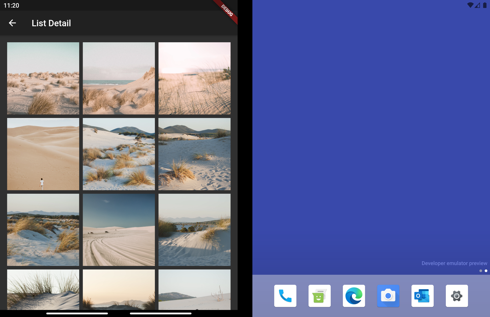 |
| 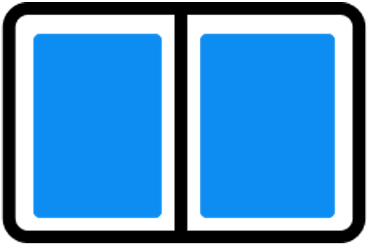 Two Page | [two_page](https://github.com/microsoft/surface-duo-sdk-samples-flutter/tree/master/design_patterns/lib/two_page) |  | 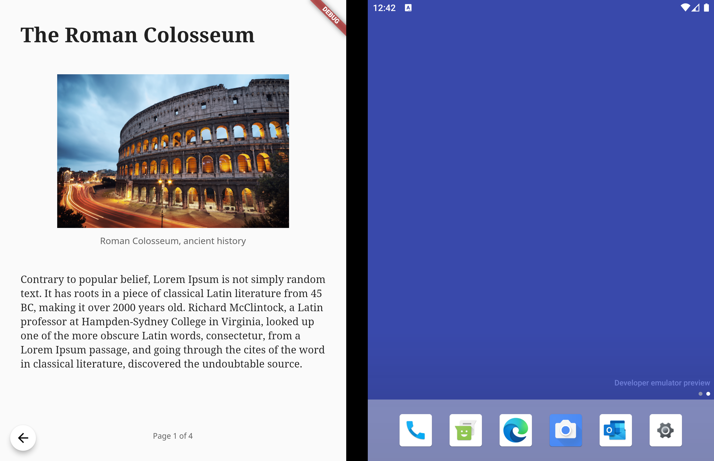 |
|  Dual View Notepad | [dual_view_notepad](https://github.com/microsoft/surface-duo-sdk-samples-flutter/tree/master/design_patterns/lib/dual_view_notepad) |  | 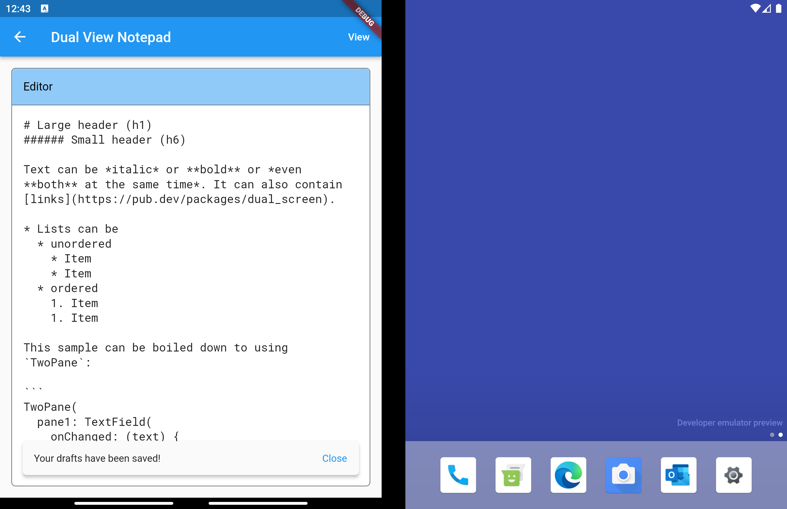 |
|  Dual View Restaurants | [dual_view_restaurants](https://github.com/microsoft/surface-duo-sdk-samples-flutter/tree/master/design_patterns/lib/dual_view_restaurants) |  | 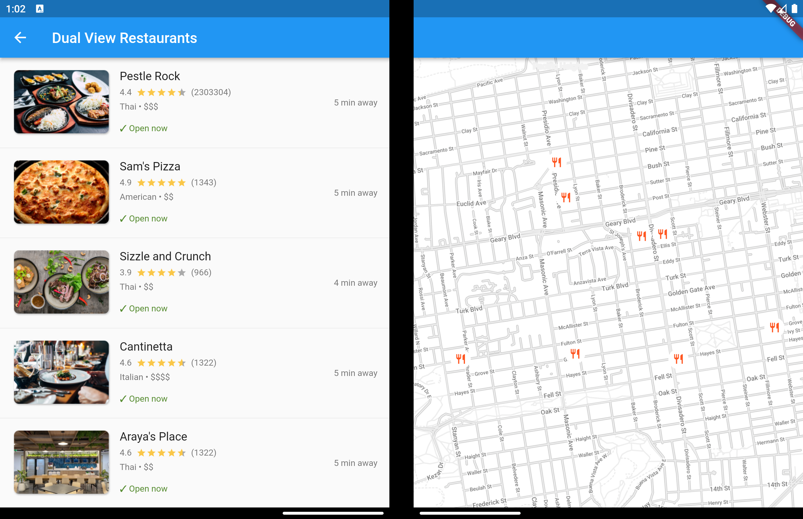 |
| 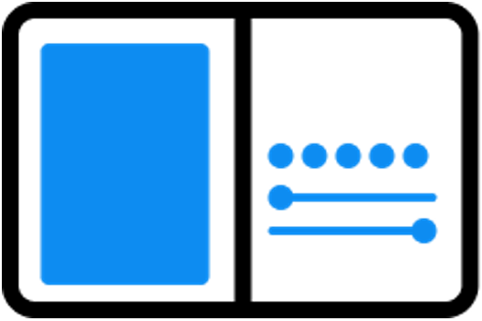 Companion Pane | [companion_pane](https://github.com/microsoft/surface-duo-sdk-samples-flutter/tree/master/design_patterns/lib/companion_pane) | 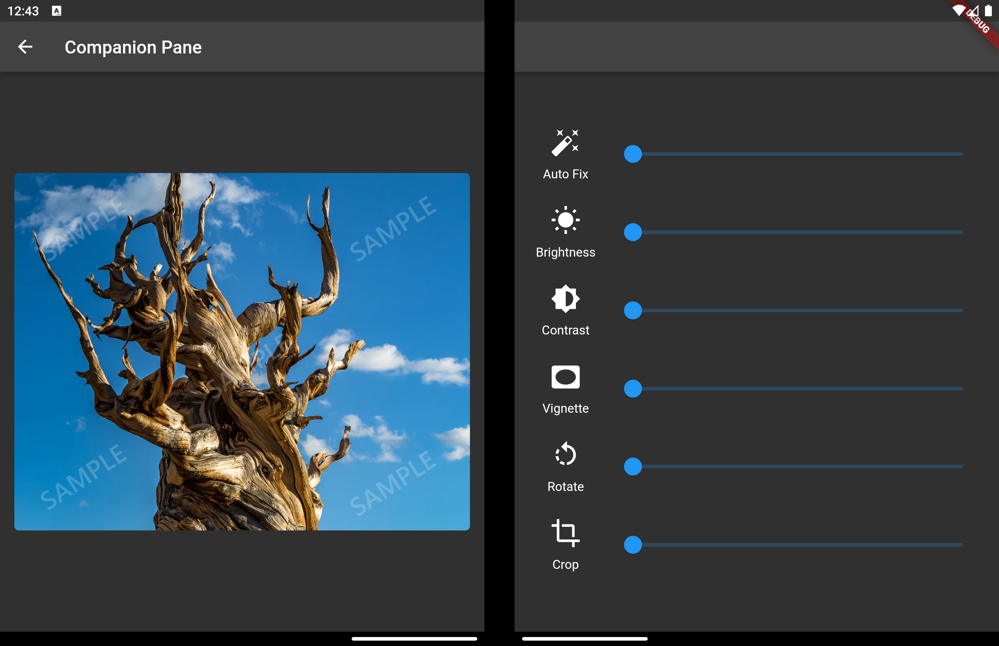 | 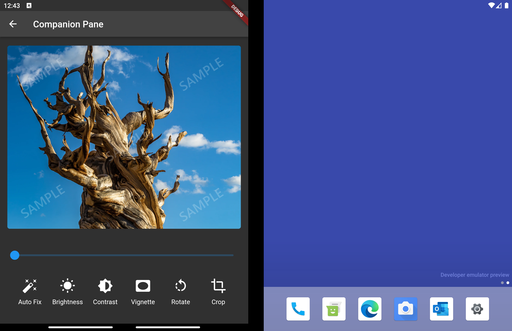 |

The [hinge_angle](https://github.com/microsoft/surface-duo-sdk-samples-flutter/tree/master/design_patterns/lib/hinge_angle) project shows how to use the hinge angle data provided by the [dual_screen](https://pub.dev/packages/dual_screen) flutter package.

More information, including design resources can be found in the [dual-screen docs](https://docs.microsoft.com/dual-screen/). All the screenshots are generated using the [Surface Duo emulator](https://docs.microsoft.com/dual-screen/android/emulator/).

## Contributing

This project welcomes contributions and suggestions.  Most contributions require you to agree to a
Contributor License Agreement (CLA) declaring that you have the right to, and actually do, grant us
the rights to use your contribution. For details, visit https://cla.opensource.microsoft.com.

When you submit a pull request, a CLA bot will automatically determine whether you need to provide
a CLA and decorate the PR appropriately (e.g., status check, comment). Simply follow the instructions
provided by the bot. You will only need to do this once across all repos using our CLA.

This project has adopted the [Microsoft Open Source Code of Conduct](https://opensource.microsoft.com/codeofconduct/).
For more information see the [Code of Conduct FAQ](https://opensource.microsoft.com/codeofconduct/faq/) or
contact [opencode@microsoft.com](mailto:opencode@microsoft.com) with any additional questions or comments.
